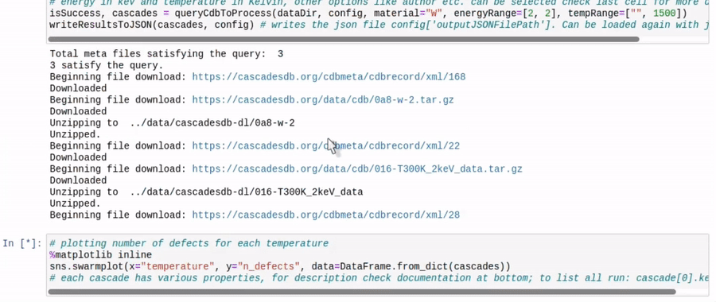
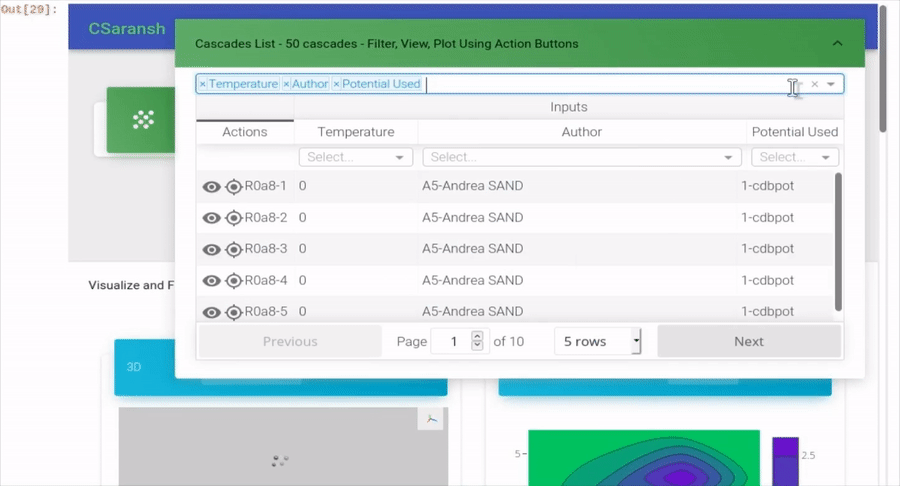
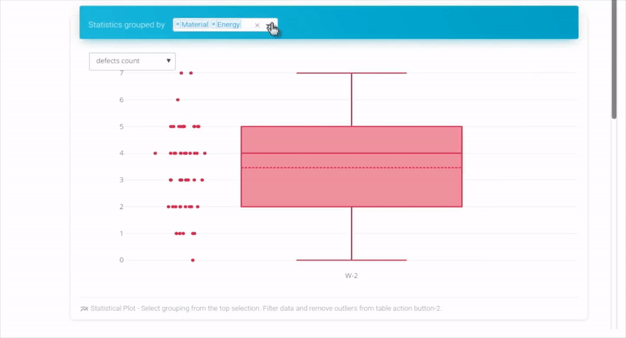
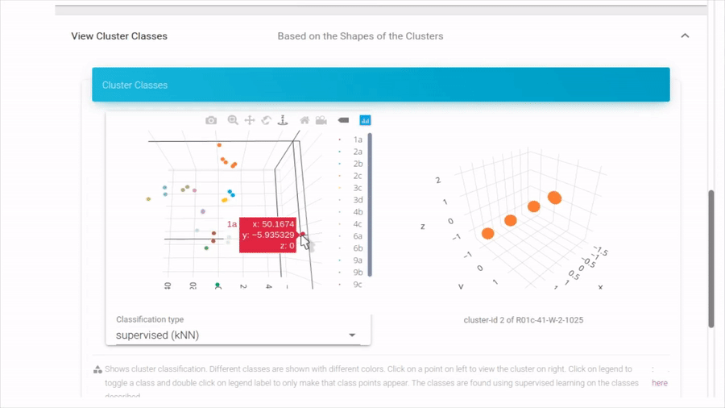
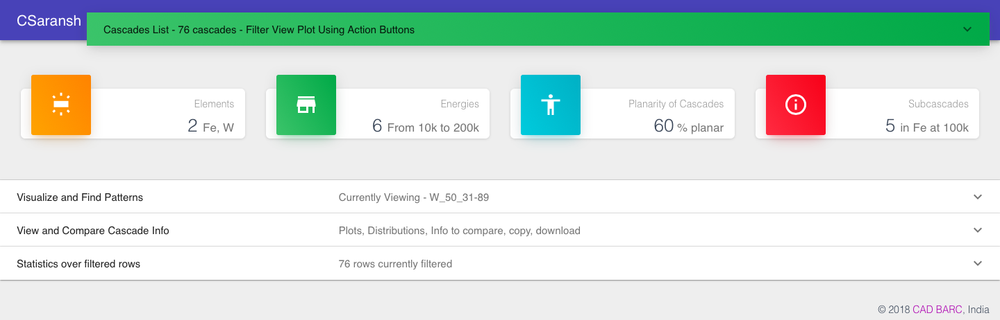
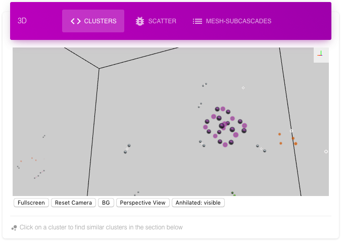
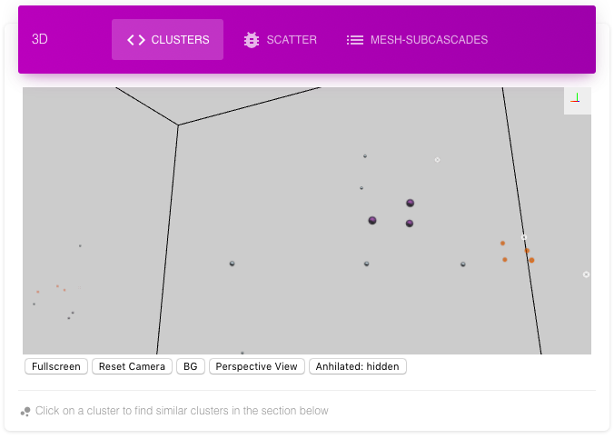
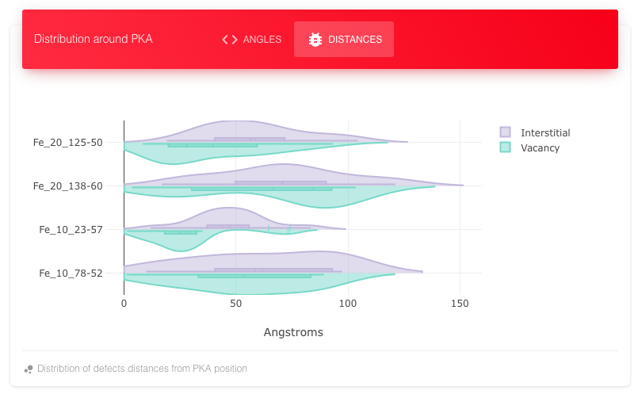
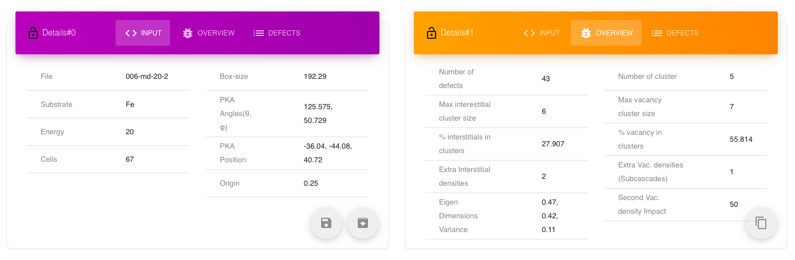

[-csaransh%20+%20binder-E66581.svg?logo=data:image/png;base64,iVBORw0KGgoAAAANSUhEUgAAAFkAAABZCAMAAABi1XidAAAB8lBMVEX///9XmsrmZYH1olJXmsr1olJXmsrmZYH1olJXmsr1olJXmsrmZYH1olL1olJXmsr1olJXmsrmZYH1olL1olJXmsrmZYH1olJXmsr1olL1olJXmsrmZYH1olL1olJXmsrmZYH1olL1olL0nFf1olJXmsrmZYH1olJXmsq8dZb1olJXmsrmZYH1olJXmspXmspXmsr1olL1olJXmsrmZYH1olJXmsr1olL1olJXmsrmZYH1olL1olLeaIVXmsrmZYH1olL1olL1olJXmsrmZYH1olLna31Xmsr1olJXmsr1olJXmsrmZYH1olLqoVr1olJXmsr1olJXmsrmZYH1olL1olKkfaPobXvviGabgadXmsqThKuofKHmZ4Dobnr1olJXmsr1olJXmspXmsr1olJXmsrfZ4TuhWn1olL1olJXmsqBi7X1olJXmspZmslbmMhbmsdemsVfl8ZgmsNim8Jpk8F0m7R4m7F5nLB6jbh7jbiDirOEibOGnKaMhq+PnaCVg6qWg6qegKaff6WhnpKofKGtnomxeZy3noG6dZi+n3vCcpPDcpPGn3bLb4/Mb47UbIrVa4rYoGjdaIbeaIXhoWHmZYHobXvpcHjqdHXreHLroVrsfG/uhGnuh2bwj2Hxk17yl1vzmljzm1j0nlX1olL3AJXWAAAAbXRSTlMAEBAQHx8gICAuLjAwMDw9PUBAQEpQUFBXV1hgYGBkcHBwcXl8gICAgoiIkJCQlJicnJ2goKCmqK+wsLC4usDAwMjP0NDQ1NbW3Nzg4ODi5+3v8PDw8/T09PX29vb39/f5+fr7+/z8/Pz9/v7+zczCxgAABC5JREFUeAHN1ul3k0UUBvCb1CTVpmpaitAGSLSpSuKCLWpbTKNJFGlcSMAFF63iUmRccNG6gLbuxkXU66JAUef/9LSpmXnyLr3T5AO/rzl5zj137p136BISy44fKJXuGN/d19PUfYeO67Znqtf2KH33Id1psXoFdW30sPZ1sMvs2D060AHqws4FHeJojLZqnw53cmfvg+XR8mC0OEjuxrXEkX5ydeVJLVIlV0e10PXk5k7dYeHu7Cj1j+49uKg7uLU61tGLw1lq27ugQYlclHC4bgv7VQ+TAyj5Zc/UjsPvs1sd5cWryWObtvWT2EPa4rtnWW3JkpjggEpbOsPr7F7EyNewtpBIslA7p43HCsnwooXTEc3UmPmCNn5lrqTJxy6nRmcavGZVt/3Da2pD5NHvsOHJCrdc1G2r3DITpU7yic7w/7Rxnjc0kt5GC4djiv2Sz3Fb2iEZg41/ddsFDoyuYrIkmFehz0HR2thPgQqMyQYb2OtB0WxsZ3BeG3+wpRb1vzl2UYBog8FfGhttFKjtAclnZYrRo9ryG9uG/FZQU4AEg8ZE9LjGMzTmqKXPLnlWVnIlQQTvxJf8ip7VgjZjyVPrjw1te5otM7RmP7xm+sK2Gv9I8Gi++BRbEkR9EBw8zRUcKxwp73xkaLiqQb+kGduJTNHG72zcW9LoJgqQxpP3/Tj//c3yB0tqzaml05/+orHLksVO+95kX7/7qgJvnjlrfr2Ggsyx0eoy9uPzN5SPd86aXggOsEKW2Prz7du3VID3/tzs/sSRs2w7ovVHKtjrX2pd7ZMlTxAYfBAL9jiDwfLkq55Tm7ifhMlTGPyCAs7RFRhn47JnlcB9RM5T97ASuZXIcVNuUDIndpDbdsfrqsOppeXl5Y+XVKdjFCTh+zGaVuj0d9zy05PPK3QzBamxdwtTCrzyg/2Rvf2EstUjordGwa/kx9mSJLr8mLLtCW8HHGJc2R5hS219IiF6PnTusOqcMl57gm0Z8kanKMAQg0qSyuZfn7zItsbGyO9QlnxY0eCuD1XL2ys/MsrQhltE7Ug0uFOzufJFE2PxBo/YAx8XPPdDwWN0MrDRYIZF0mSMKCNHgaIVFoBbNoLJ7tEQDKxGF0kcLQimojCZopv0OkNOyWCCg9XMVAi7ARJzQdM2QUh0gmBozjc3Skg6dSBRqDGYSUOu66Zg+I2fNZs/M3/f/Grl/XnyF1Gw3VKCez0PN5IUfFLqvgUN4C0qNqYs5YhPL+aVZYDE4IpUk57oSFnJm4FyCqqOE0jhY2SMyLFoo56zyo6becOS5UVDdj7Vih0zp+tcMhwRpBeLyqtIjlJKAIZSbI8SGSF3k0pA3mR5tHuwPFoa7N7reoq2bqCsAk1HqCu5uvI1n6JuRXI+S1Mco54YmYTwcn6Aeic+kssXi8XpXC4V3t7/ADuTNKaQJdScAAAAAElFTkSuQmCC)](https://mybinder.org/v2/gh/haptork/csaransh/master?filepath=csaransh_pp%2Fexamples%2Fcascades-db_cascadesWithMetaFile.ipynb)

 (prefer [binder](https://mybinder.org/v2/gh/haptork/csaransh/master?filepath=csaransh_pp%2Fexamples%2Fcascades-db_cascadesWithMetaFile.ipynb) for inline webapp)

What's new in Version (0.4):
===========
__Check latest [release](https://github.com/haptork/csaransh/releases/tag/0.4) or develop branch to get this version.__

- No need for input files, the inputs are now also taken from stdin if no input file is found.
- The new cluster plots use _SaVi_ algorithm to plot the lines along the string of displaced atoms / crowdions / dumbbells.
- Minor fixes and improvements.

Csaransh
==================================

## What is CSaransh?

The sofware suite to post-process, explore and visualize Molecular Dynamics (MD) simulations of collision cascades. It is a one click solution to begin analysing, exploring patterns and statistics in a collision cascade database. Run through [this notebook](https://mybinder.org/v2/gh/haptork/csaransh/master?filepath=csaransh_pp%2Fexamples%2Fcascades-db_cascadesWithMetaFile.ipynb) to jump start querying, analysing and playing with the cascadesDB database online, now.

## Features

- One line to get all the cascade results in a python variable `isSuccess, cascades = queryCdbToProcess(dataDir, config, material="W", energyRange=[2, 3], tempRange=["", 1500])` which is ready to be explored with python or opened in interactive web-app loaded with interactive plots.

*Starting from selecting cascades of interest based on different criterion (energy range, temperature, author etc.), to download, processing, visualizations, to statistics based on different grouping, it is all automated.*

- Web-app with loads of features to explore the data.

*A feature loaded table view with column selection, multi-sort, reflective filters that provide a way to query the data quickly. If you select a filter, other filters reflect the options left.*

*Quickly view and compare the statistics of different parameters such as defects count, cascade volume etc. split on any combination of input fields such as grouped by energy & elements, temperature, potential etc.*

*Clusters classification into different shape classes with interactive 3D view.*

Play with the cascades database youself by running the example notebook online [here](https://mybinder.org/v2/gh/haptork/csaransh/master?filepath=csaransh-pp%2Fexamples%2Fcascades-db_cascadesWithMetaFile.ipynb).

## Related Articles, Citation & Acknowledgements

You can check the web page for the project ([link](https://haptork.github.io/csaransh/)) and read the [manual](https://github.com/haptork/csaransh#getting-started) to go through the different sections. The web page shows the results for the MD [database of IAEA Challenge on Materials for Fusion 2018](https://www-amdis.iaea.org/CDB/challenge/).

Publications and Talks:

- _SaVi_ defect morphology algorithm: [paper](https://www.sciencedirect.com/science/article/abs/pii/S0927025621001993)
- Potential comparison based on morphology using _SaVi_: [paper](https://doi.org/10.1088/1361-651X/ac095d)
- [MoD-PMI 2021](https://www.fz-juelich.de/conferences/PFMC-18/EN/MoD-PMI-2021/artikel.html) talk on _SaVi_ algorithm and its applications [presentation](https://haptork.github.io/csaransh/presentation/savi.html)
- Unsupervised morphology classification and searching similar defects: [paper](https://doi.org/10.1016/j.commatsci.2019.109364)
- [MoD-PMI 2019](http://dpc.nifs.ac.jp/dkato/MoD-PMI2019/) talk on  defect identification algorithm used and classification of clusters [presentation](https://haptork.github.io/csaransh/presentation/index.html).
- For citation of Csaransh use [JOSS paper](http://joss.theoj.org/papers/72f2ddde2112497826753319956ea8ab).

The initial version was submitted to the
[IAEA Challenge on Materials for Fusion 2018](https://challenge.iaea.org/challenges/2018-NA-Mat-Fusion) as an
entry from [Bhabha Atomic Research Center (BARC)](http://www.barc.gov.in) by Utkarsh Bhardwaj, Ashok Arya, Harsh Hemani, Nancy Semwal and Manoj Warrier. Many thanks to the team, the challenge organizers and the judges for their encouraging words.

## Getting started

### Dependencies and Requirements

- gcc 5.3 or later or equivalent c++14 compiler.
- Python 3.x or Python 2.7 or above

### Quick start

- You can run csaransh online on [binder](https://mybinder.org/v2/gh/haptork/csaransh/master?filepath=csaransh-pp%2Fexamples%2Fcascades-db_cascadesWithMetaFile.ipynb) or [colab](https://colab.research.google.com/drive/1PmXmoPo7_hGqTK62serwlx4hdksCuGQO). These are free online python notebook environments.

Alternatively use any of the following methods for using offline on your local system:

- Method 1 (with python notebook):
  - You will need to install required python packages to run it on your system for that, run `conda env create -f environment.yml` and `conda activate csaransh` if you are using conda, or you can use `pip install -r requirements.txt` from the csaransh-pp directory to install python dependencies. Both `environment.yml` and `requirements.txt` files are in csaransh-pp directory, so run the above commands from csaransh-pp directory or give full path to these files in the command.
  - After installation open any example python notebook from `csaransh-pp/examples` (can be done by running `jupyter notebook` command from terminal). You can modify these examples to process your own data. All the necessary information for modification is given in the notebooks.

- Method 2 (with python):
  - Install python packages as given in Method 1 above.
  - Build csaransh-pp:
    - Go to csaransh-pp directory.
    - Make a new directory `_build`. Go to this directory and run `cmake ..` and then `cmake --build .`.
  - Run any python `.py` example given in `csaransh-pp/examples` directory with `examples` as current directory. The command would look something like `python cascadesWithOnlyXyz.py`. You can modify these examples to process your own data. All the necessary information for modification is given in the comments of the examples directory.
  
- Method 3 (with csaransh executable):
  
  - After installing python packages and building the application as given in Method 2, the executable `csaransh_pp` can be found in the `_build` directory. This is the main post-processor for processing xyz files. You can run `make install` to add it to the system path. You can run the tests from the *csaransh_pp* directory by running the `csaransh_pp_test` application that gets built in the `_build` directory, the command would look like `./_build/csaransh_pp_test`.
  
  - Post-process:
    + You only need to run the post-processor once on the data-set.
    + Run command should look something like this: `%PATH%/csaransh_pp data/*/*xyz` (this works on the sample data given with the repository). Executing the csaransh_pp without arguments gives help with a list of arguments.
    + The .in file must be there in the same directory as the corresponding xyz file and should have the same name. Please check `csaransh-pp/data/` directory for examples. Following MD simulation output formats are accepted:
    + Parcas xyz with Parcas input file.
    + LAMMPS xyz with input file written as shown in the examples in `csaransh_pp/data/lammps/` directory.
    + Displacement xyz file with input file same as LAMMPS input file. The displacement xyz must have vacancy coordinates followed by interstitial coordinates in each line which could have been found by any method of choice. The example displaced files are given in `csaransh_pp/data/disp/` directory.
    + The output JSON file cascades-data.json is written in current directory.
    + From the directory where cascades-data.json is located run the script `pp.py` script given in csaransh-pp directory, `python %PATH%/pp.py`. If running from some other directory where cascades-data.json is not there, pass path to cascades-data.json as the first argument to the python script as `python %PATH%/bin/pp.py %PATH%/cascades-data.json`. This script might take a few minutes before it generates `cascades-data.js` output file. If any import errors appear, install the python package using `pip install` or `easy-install` or use anaconda for python.
  -  To view the new processed data on your system using HTML app, copy the cascades-data.js to `csaransh-pp/examples/apps/CSaransh-files` directory and open `index.html` in `csaransh-pp/examples/apps/`. However, it is better to first start a  local server by running `python3 -m http.server 3000 --bind 127.0.0.1` from the directory `examples` directory and then opening `localhost:3000/apps/index.html` from the web browser.
  - Loading & Viewing New Processed Results in online app:
    - To view the processed data in online app, fork the project.
    - Go to the forked repository and replace the cascades-data.js in the gh-pages branch with the new data file.
    - To do this, using github. Go to the forked repo; from home page change from master branch to gh-pages branch; go to CSaransh-files dir. and delete the cascades-data.js file; select upload files and upload your cascades-data.js file.
    - Alternatively, if you know git commands, clone the forked repo, checkout to gh-pages branch, replace the cascades-data.js file with your data file, commit the change and push changes to the main branch.
    - In your forked repository, go to the gh-pages link which would be something like: https://{yourusername}.github.io/csaransh/

## More info on using csaransh web-app to explore cascades data

When you open the app you see a clickable green header at the top, some summary information for the complete data and four panel headers that you can open by clicking.

### Table
You can filter the data from the table to find a desired cascade or range of cascades. The statistics (third panel) are done only on the filtered data. Sorting can be done by clicking on the headers. For multi-sort hold the shift key and then click. 

The filters update in the real time according to other filters to show range. For the image given below, The filter is applied on Material, Energy and 1D-variance columns, other column filters show the range of values that are there in the filtered data. We see that defects count for these constraints are between 0 to 242 in the image. In current newer versions you can select the columns to view in the table.

#### Action buttons
The first button (eye) is used to view the current cascade in first and second panels viz. Visualize and View & Compare Info. The Second button (ban) is used to exclude a cascade from the statistics. This can be used to exclude outliers so that the rest of the statistics and correlations can be understood.

### Visualize and Find Patterns
The plots show a single cascade, its Subcascade, clusters and similar clusters in the whole database. Any cascade can be viewed by clicking on first button in the table. The name of the cascade is Material_Energy_PKAtheta_PKAphi. The name of a cluster is its unique clusterId followed by cascade name.

#### Cascade View and Cluster Shapes
The First 3D view called clusters shows the whole cascade with different colors for different clusters. The annihilated interstitial, vacancy pair can be shown, hidden or shown with less opacity (default). These annihilated pairs are useful to define the shape of the cluster, its dimensionality and hence properties (diffusion etc). Following is the same cluster with and without annihilated defects. Note that conventional Wigner-Seitz does not find annihilated defects.

*The cluster with annihilated interstitials and vacancies shows a ring structure*

*Same cluster without annihilated interstitials and vacancies shows no structure*

Clicking on a cluster of significant size (>3) selects the cluster for finding similar clusters in the whole database which is displayed in the next section below it.

#### Finding same patterns
The Cluster Comparison shows the top 5 matches from the complete database for the selected cluster from the cascade. There are different criteria for matches. Clicking on 1-5 views that cluster. The name of the cluster is cluster-id for the cluster, followed by cascade name (material_energy_theta_phi). The Eigen variance shows the dimensionality of the cluster. The clusters are plotted with their Eigen coordinates so that they can be compared one to one.

*Top five matches for the above cluster from the complete database of cascades*

#### Subcascades
The subcascade mesh shows different vacancy dense regions with different colors. The same information can be inferred from scatter plot and contour plot for vacancy. The following images show a cascade with four subcascades in different views. All these plots are in their Eigen basis (principle components) with x-axis having maximum variance, then y-axis and then z-axis.

### View and Compare Info
Clicking on the action button on the table adds the cascade information to the plots and table of this panel. For the last four selected cascades, the plots show cluster size distribution, distribution of angles and distances with reference to PKA direction and origin position. 

The tables show input information, output details and list of defects. There are also options to download and copy the input and output details. The table view can be locked to hold the info of current selected cascade unless unlocked. In this way two tables can be either used to show different information (input on one and output on one) for the same cascade or to compare the cascades with respect to a single locked one.

## Statistics
The statistics is calculated over the filtered data. So if one wants to find statistics for an element over all the energies, the filter on material column in the table can be used. Similarly, for finding and comparing statistics for different elements on same energies, the filter on energies can be used. A combination of grouping columns can be selected to compare statistics on, such as n_defects for different energies, temperatures, potentials used etc. The statistics pane also has a correlation matrix plot for various parameters.

## Cluster Shapes Classification

The scatter plot on the left pane plots each cluster in the database as a point. The clusters that have similar shapes are plotted close to each other than the clusters with dissimilar shapes. The different classes of cluster shapes are represented by different colors.

The plots can give insights about all the different shapes present and how they are distributed among different elements and energies.

## Algorithms Overview

An overview of the important algorithms and novel approaches to radiation damage used in the software are briefly discussed below.

### Defects Identification

1. Using modulo arithmetic find closest point in the lattice for each atomic co-ordinate. Also, find the distance between closest point in the lattice and the atom (csaransh-pp/src/AddOffset.cpp) [jcomp16](https://doi.org/10.1016/j.jcp.2015.10.034)
2. Sort the atomic coordinates by the closest point in the lattice for each.
3. Go through the sorted list. If a lattice point is missing then mark it as vacancy. If a lattice point is repeated then mark the more distant atom as interstitial. While marking the distant point as interstitial, also mark the other repeated atom as annihilated interstitial and lattice point as annihilated vacancy if the distance between the two is greater than some threshold.

The algorithm has time-complexity of O(N(logN)).

### Vacancy and Interstitial Clusters

We use union find datastructure to keep the clusters efficiently. The annihilated interstitials and vacancies also contribute to the clustering, so that crowdions, complex ring structures etc. can be grouped in the same cluster.

### Features for Pattern Matching

For each cluster we find histograms of the angles of each triplets in the cluster, histogram of pair of distances and histogram of adjacency of each node. The techniques are taken from graph theory and topography. We also define the coordinates of the clusters in their Eigen basis so that different distance measures like Hausdorff distance etc. can be used. However, the much efficient histogram matching especially for angles is found to be effective for matching clusters and classifying them. The histogram matching is also resilient to noise compared to strict distance measures.

### Comparison of Features

We found different histogram distances to be equally effective. We are using Chi-square distance.

### Dimensionality

We are using principle component analysis with singular value decomposition, to find the Eigen like basis and idea of dimensionality for cascades, subcascades as well as clusters.

### Subcascades

We are using DBSCAN algorithm for vacancies to find the vacancy density clusters. We find the impact of a subcascade as the number of vacancies in the cluster. We found the density based clustering with some obvious tweaking (ignoring very less impact subcascades) to be a good measure of subcascading and its impact measure.

### Classification and Dimensionality Reduction

We use [UMAP](https://umap-learn.readthedocs.io/en/latest/) and [t-SNE](https://scikit-learn.org/stable/modules/generated/sklearn.manifold.TSNE.html) for dimensionality reduction on the cluster features found for pattern matching. We use these embeddings for plotting and to find the classification with [HDBSCAN](https://pypi.org/project/hdbscan/) algorithm.

## Contributions

Contributions are welcome in the form of suggestions, ideas, code, bug fixes, constructive feedback. To begin understanding the implementation of algorithms in the post-processor, you can check tests written in the `csaransh-pp/test` directory.

The current direction for web interface is to add help to different sections, add more interactions to plots and improve the efficiency of the interface by splitting the single webpack js file into different bundles. 

Check issues for more specific contributions.
